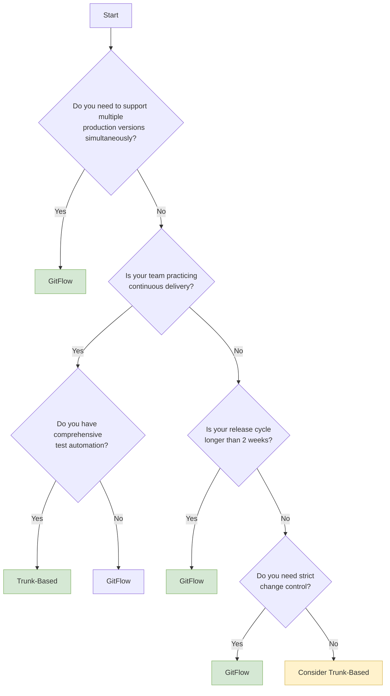

# Version Control Strategies: Trunk-Based vs GitFlow

> **Quick Navigation**  
> [Development Home](../README.md) | [Next: Git Mastery →](../01-git-mastery/README.md)

> **Learning Objectives**
> - Understand the core principles of Trunk-Based Development and GitFlow
> - Learn when to use each strategy based on project requirements
> - Explore real-world case studies from top tech companies
> - Practice with hands-on exercises and labs
> - Make informed decisions using the provided decision tree

## Overview

This chapter explores two dominant version control strategies used in modern software development: Trunk-Based Development (TBD) and GitFlow. Understanding these approaches is crucial for implementing efficient CI/CD pipelines and optimizing team workflows.

## Table of Contents
- [Trunk-Based Development (TBD)](#trunk-based-development-tbd)
- [GitFlow](#gitflow)
- [Head-to-Head Comparison](#head-to-head-comparison)
- [Industry Adoption](#industry-adoption)
- [Choosing the Right Strategy](#choosing-the-right-strategy)
- [Implementation Guide](#implementation-guide)

## Trunk-Based Development (TBD)

### Core Principles
- **Single Source of Truth**: All developers work on short-lived branches from `main`
- **Continuous Integration**: Multiple integrations per developer per day
- **Feature Flags**: Manage feature releases without long-lived branches
- **Small, Atomic Changes**: Encourages small, focused commits

### When to Use
- Teams practicing Continuous Delivery/Deployment
- Mature DevOps culture with strong test automation
- Projects requiring rapid iteration and feedback
- Organizations with monorepos

### Example Workflow
```bash
# Start a new feature
git checkout -b feature/new-authentication main

# Make small, focused commits
git add .
git commit -m "Add login form component"

# Frequently sync with main
git fetch origin
git rebase origin/main

# Push and create pull request
git push -u origin feature/new-authentication
# After PR approval, squash and merge to main
```

## GitFlow

### Core Principles
- **Strict Branching Model**: Defines specific branches for features, releases, and hotfixes
- **Release Preparation**: Dedicated release branches for stabilization
- **Versioned Releases**: Clear versioning through tags
- **Parallel Development**: Supports multiple versions in production

### When to Use
- Projects with scheduled release cycles
- Teams needing to support multiple production versions
- Regulated industries requiring rigorous change control
- Open source projects with many contributors

### Example Workflow
```bash
# Start a new feature from develop
git checkout -b feature/payment-integration develop

# Work on feature
# ...

# Merge back to develop
git checkout develop
git merge --no-ff feature/payment-integration

# Start a release
git checkout -b release/1.2.0 develop
# Fix bugs, update version numbers

git checkout main
git merge --no-ff release/1.2.0
git tag -a v1.2.0

# Update develop
git checkout develop
git merge --no-ff release/1.2.0
```

## Head-to-Head Comparison

| Aspect                | Trunk-Based Development         | GitFlow                          |
|-----------------------|--------------------------------|----------------------------------|
| **Branching**         | Short-lived feature branches    | Long-lived branches              |
| **Integration**       | Multiple times per day         | Before releases                  |
| **Release Cadence**   | Multiple per day               | Scheduled releases               |
| **Complexity**        | Low                            | High                             |
| **Learning Curve**    | Low                            | Steep                            |
| **Best For**          | CI/CD, cloud-native            | Versioned releases, monoliths    |
| **Team Size**         | Any, better for larger teams   | Better for smaller teams         |
| **Tooling**           | Requires CI/CD                 | Simpler CI/CD requirements       |

## Industry Adoption & Case Studies

### Trunk-Based Development in Action

#### Google
- **Scale**: 2+ billion lines of code in a single repository
- **Approach**: All engineers commit to the main branch multiple times daily
- **Results**: 
  - 50,000+ commits per workday
  - 2+ million automated tests run daily
  - 85% of changes committed directly to main
- **Key Learning**: "If it's not in main, it's not done"

#### Netflix
- **Challenge**: Need for rapid experimentation
- **Solution**: TBD with feature flags and canary releases
- **Results**:
  - Thousands of production deployments daily
  - 2-minute mean time to detect issues
  - 7-minute mean time to recover
- **Key Learning**: "We optimize for speed and safety, not process"

### GitFlow in Practice

#### GitLab
- **Model**: Modified GitFlow with environment branches
- **Workflow**:
  - `main` for production
  - `staging` for pre-production
  - Feature branches for development
- **Results**:
  - Predictable release cycles
  - Clear separation of concerns
  - Easy hotfix management
- **Key Learning**: "The right tool for our scale and release cadence"

#### Financial Services Company (Fortune 100)
- **Requirements**: Strict compliance, audit trails
- **Solution**: GitFlow with additional compliance gates
- **Results**:
  - Full traceability of changes
  - Clear separation of releases
  - Compliance with financial regulations
- **Key Learning**: "Process and control are non-negotiable"

## Decision Tree: Choosing Your Strategy



## Hands-On Exercises

### Exercise 1: Setting Up a Trunk-Based Workflow
1. **Objective**: Create a simple CI/CD pipeline with TBD
2. **Steps**:
   ```bash
   # 1. Initialize a new repository
   git init tbd-demo
   cd tbd-demo
   
   # 2. Create initial files
   echo "# My Awesome Project" > README.md
   
   # 3. Create a feature branch
   git checkout -b feature/add-login
   
   # 4. Make some changes
   mkdir src
   echo "console.log('Login component')" > src/login.js
   
   # 5. Commit and push
   git add .
   git commit -m "Add login component"
   
   # 6. Create a pull request (simulated)
   echo "Create PR from feature/add-login to main"
   ```
3. **Discussion**:
   - How does this differ from your current workflow?
   - What challenges might you face with this approach?

### Exercise 2: Implementing GitFlow
1. **Objective**: Set up a GitFlow workflow for a release
2. **Steps**:
   ```bash
   # 1. Initialize GitFlow
   git flow init
   
   # 2. Start a new feature
   git flow feature start payment-integration
   
   # 3. Make changes
   echo "Payment processing" > payment.js
   git add .
   git commit -m "Add payment processing"
   
   # 4. Finish the feature
   git flow feature finish payment-integration
   
   # 5. Start a release
   git flow release start 1.0.0
   
   # 6. Finish the release
   git flow release finish 1.0.0
   ```
3. **Discussion**:
   - When would this workflow be beneficial?
   - What overhead does this add compared to TBD?

### Exercise 3: Feature Flags in Practice
1. **Objective**: Implement a feature flag system
2. **Steps**:
   ```javascript
   // feature-flags.js
   const features = {
     newDashboard: true,
     darkMode: false,
     experimentalAPI: process.env.ENABLE_EXPERIMENTAL === 'true'
   };
   
   // app.js
   if (features.newDashboard) {
     // New dashboard code
   } else {
     // Old dashboard code
   }
   ```
3. **Task**:
   - Create a simple Express.js app with feature flags
   - Deploy it with different flags enabled/disabled
   - Discuss how this enables TBD

## Real-World Scenarios

### Scenario 1: E-commerce Platform
- **Challenge**: Need to deploy new features quickly during holiday season
- **Solution**: Trunk-Based Development with feature flags
- **Result**: 5x faster deployment frequency, zero major incidents

### Scenario 2: Banking Application
- **Challenge**: Strict compliance requirements, quarterly releases
- **Solution**: GitFlow with additional compliance branches
- **Result**: Full audit trail, predictable release schedule

## Choosing the Right Strategy

### Choose Trunk-Based When:
- You practice continuous delivery/deployment
- Your team has strong testing practices
- You need rapid feedback cycles
- You're building cloud-native applications

### Choose GitFlow When:
- You have scheduled release cycles
- You need to maintain multiple versions in production
- You're in a regulated industry
- Your team is distributed across timezones

## Implementation Guide

### Migrating to Trunk-Based Development
1. **Start Small**: Begin with a single team/project
2. **Feature Flags**: Implement a feature flag system
3. **CI/CD Pipeline**: Ensure robust test automation
4. **Small Batches**: Train team on small, atomic changes
5. **Monitor**: Track metrics like lead time and deployment frequency

### Implementing GitFlow
1. **Tooling**: Set up GitFlow tools or aliases
2. **Documentation**: Create clear guidelines for the team
3. **Release Process**: Define your release management process
4. **Versioning**: Choose semantic versioning strategy

## Integrating with CI/CD

### Trunk-Based CI/CD Pipeline Example
```yaml
# .gitlab-ci.yml
stages:
  - test
  - build
  - deploy

test:
  stage: test
  script:
    - npm test
    - npm run e2e

build:
  stage: build
  script:
    - docker build -t myapp:$CI_COMMIT_SHA .
    - docker push myapp:$CI_COMMIT_SHA

deploy_staging:
  stage: deploy
  environment: staging
  script:
    - kubectl set image deployment/myapp myapp=myapp:$CI_COMMIT_SHA
  only:
    - main

deploy_production:
  stage: deploy
  environment: production
  script:
    - kubectl set image deployment/myapp myapp=myapp:$CI_COMMIT_SHA
  when: manual
  only:
    - main
```

### GitFlow CI/CD Pipeline Example
```yaml
# .gitlab-ci.yml
stages:
  - test
  - build
  - release
  - deploy

# Runs on all branches
test:
  stage: test
  script: npm test

# Only run on develop and release branches
build:
  stage: build
  script:
    - docker build -t myapp:$CI_COMMIT_REF_SLUG-$CI_COMMIT_SHA .
    - docker push myapp:$CI_COMMIT_REF_SLUG-$CI_COMMIT_SHA
  only:
    - develop
    - /^release\/.*$/

release:
  stage: release
  script:
    - ./bump-version.sh
    - git tag -a v$(cat VERSION) -m "Release $(cat VERSION)"
    - git push origin v$(cat VERSION)
  only:
    - /^release\/.*$/

deploy_production:
  stage: deploy
  script:
    - kubectl set image deployment/myapp myapp=myapp:main-$CI_COMMIT_SHA
  only:
    - main
```

## Further Reading & Resources
- [Trunk-Based Development](https://trunkbaseddevelopment.com/)
- [GitFlow Documentation](https://nvie.com/posts/a-successful-git-branching-model/)
- [Feature Toggles (Feature Flags)](https://martinfowler.com/articles/feature-toggles.html)
- [Google's Monorepo and TBD](https://cacm.acm.org/magazines/2016/7/204032-why-google-stores-billions-of-lines-of-code-in-a-single-repo/fulltext)
- [Netflix Deployment Strategies](https://netflixtechblog.com/)
- [GitLab's Approach to GitFlow](https://about.gitlab.com/blog/2020/03/05/what-is-gitlab-flow/)
- [Feature Flags Best Practices](https://launchdarkly.com/blog/)
- [Trunk-Based Development at Scale](https://www.infoq.com/presentations/trunk-based-development/)

## Assessment

### Quiz
1. What is the main difference between TBD and GitFlow in terms of branching strategy?
2. Name three companies that successfully use Trunk-Based Development.
3. When would you recommend using GitFlow over TBD?
4. What is the purpose of feature flags in TBD?
5. How does the CI/CD pipeline differ between TBD and GitFlow?

### Hands-On Challenge
1. Set up a new project using Trunk-Based Development
2. Implement a feature using feature flags
3. Create a CI/CD pipeline that supports your chosen workflow
4. Document the process and challenges faced

## Conclusion

Both Trunk-Based Development and GitFlow have their place in modern software development. The key is to understand your team's needs, release cadence, and risk tolerance when choosing between them. Many successful companies use a hybrid approach that combines the best of both worlds.

Remember, the goal is not to follow a specific methodology dogmatically, but to optimize your workflow for delivering value to your users quickly and safely.

---

**Next:** [Git Mastery →](../01-git-mastery/README.md)

---

**Next:** [Git Mastery →](../01-git-mastery/README.md)
