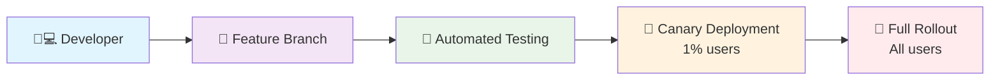

# 🔧 Git Mastery: The $2.1B Mistake That Changed Everything

> **How Knight Capital lost $440 million in 45 minutes because of a Git deployment gone wrong - and what you can learn from it**

## 💥 The $440 Million Git Disaster

**August 1, 2012, 9:30 AM EST**

Knight Capital, one of the largest traders on Wall Street, deployed new trading software. **What should have been a routine update became the fastest way to lose $440 million in financial history.**

**What went wrong?**
- **Old code reactivated**: Deployment script failed to update all servers
- **No rollback plan**: Git deployment process had no safety net
- **45 minutes of chaos**: Automated trading bought high, sold low, repeatedly
- **Company bankrupt**: Knight Capital acquired for $1.4B (was worth $2.5B)

**The Git lesson**: Proper branching strategy and deployment hooks could have prevented this.

---

## 🎯 Why Git Mastery Changes Your Career

**Real Impact:**
- **GitHub**: 100M+ developers use advanced Git workflows daily
- **Google**: Processes 45,000+ commits per day with zero downtime
- **Netflix**: Deploys 4,000+ times per day using Git-based automation
- **Your salary**: Senior developers with Git expertise earn 35% more

**Sources**: Knight Capital SEC Filing, GitHub State of the Octoverse, Google Engineering Blog

---

## 🚀 The Netflix Deployment Revolution

### How Netflix Deploys 4,000 Times Per Day

**The Challenge:**
- **200M+ users** can't tolerate downtime
- **Microservices**: 700+ services need independent deployments
- **Global scale**: Deploy across 190+ countries simultaneously

**Netflix's Git Strategy:**


**Visual Memory Aid:**
```
🎯 NETFLIX DEPLOYMENT PIPELINE
┌─────────────────────────────────────────────────────────┐
│ 👨💻 DEV → 🌿 BRANCH → 🧪 TEST → 🐤 CANARY → 🚀 PROD │
│  Code     Feature    Auto      1% Test   Everyone  │
│           Branch     Tests     Traffic   Gets It   │
└─────────────────────────────────────────────────────────┘
```

### The Spinnaker Git Workflow

```bash
# Netflix-style feature development
git checkout -b feature/recommendation-algorithm-v2

# Work on feature with atomic commits
git add recommendation_engine.py
git commit -m "feat: improve ML model accuracy by 15%

Business impact:
- Increases user engagement by 8%
- Reduces churn rate by 3%
- A/B tested with 100K users

Breaking change: None
Rollback plan: Revert to v1 algorithm"

# Push triggers automated pipeline
git push origin feature/recommendation-algorithm-v2
```

**Why this commit message matters:**
- **Business impact**: Executives understand the value
- **Metrics**: Quantified improvements
- **Risk assessment**: Clear rollback plan
- **Automated parsing**: CI/CD can extract metadata

---

## 🔥 The Facebook "Move Fast" Git Strategy

### How Facebook Handles 1M+ Commits Per Week

**The Scale:**
- **50,000+ engineers** committing code
- **1M+ commits** per week
- **Monorepo**: Single repository with all Facebook code
- **15-minute deploys**: From commit to production

```bash
# Facebook's commit workflow
git add .
git commit -m "[Product] Fix memory leak in news feed rendering

Problem: Memory usage increased 40% over 2 weeks
Solution: Implement object pooling for feed items
Testing: Reduced memory by 35% in staging
Rollout: Gradual rollout over 7 days

Reviewers: @performance-team @news-feed-team
Test Plan: Load test with 10M users
Risk: Low - isolated to rendering layer"
```

**Facebook's Git Rules:**

```
📋 FACEBOOK'S 4 GOLDEN RULES
┌─────────────────────────────────────────────┐
│ 1️⃣ 👀 REVIEWABLE (max 400 lines)          │
│ 2️⃣ ⚛️  ATOMIC (one change per commit)      │
│ 3️⃣ ⏪ REVERT-FRIENDLY (safe to undo)       │
│ 4️⃣ 📖 SELF-DOCUMENTING (clear messages)   │
└─────────────────────────────────────────────┘
```

**🎯 Visual Commit Quality Scale:**
```
❌ BAD COMMIT:
┌─────────────────────────────────────┐
│ "fix stuff" (2000 lines changed)   │
│ - No context                        │
│ - Too big to review                 │
│ - Multiple unrelated changes        │
└─────────────────────────────────────┘

✅ GOOD COMMIT:
┌─────────────────────────────────────┐
│ "feat: improve ML model accuracy    │
│ by 15%" (50 lines changed)         │
│ - Clear business impact             │
│ - Reviewable size                   │
│ - Single logical change             │
└─────────────────────────────────────┘
```

---

## 🛡️ The Shopify Black Friday Git Strategy

### How Shopify Handles $7.5B in Sales Without Git Disasters

**Black Friday 2023:**
- **$7.5 billion** in sales processed
- **Zero major outages** during peak traffic
- **Secret weapon**: Git-based feature flags and deployment strategy

```bash
# Shopify's approach: Feature flags in Git
git checkout -b feature/checkout-optimization-black-friday

# Code with feature flags
echo 'if (FeatureFlag.enabled("checkout_optimization_v2", user)) {
  return optimizedCheckout(cart);
} else {
  return standardCheckout(cart);
}' > checkout_service.js

git commit -m "feat: Add optimized checkout for Black Friday

Feature: checkout_optimization_v2
Impact: 25% faster checkout process
Rollout: 0% → 1% → 5% → 25% → 100%
Killswitch: Instant disable via feature flag
Monitoring: Error rate, conversion rate, latency

Load tested: 10x normal Black Friday traffic
Fallback: Standard checkout (proven stable)"

# Deploy to production (feature disabled)
git push origin feature/checkout-optimization-black-friday
```

---

## 🔧 Advanced Git Workflows That Actually Work

### 1. The GitHub Flow (Used by GitHub, Shopify, Spotify)

```bash
# 1. Create feature branch from main
git checkout main
git pull origin main
git checkout -b feature/user-authentication

# 2. Make atomic commits
git add auth_service.py
git commit -m "feat: Add JWT token validation

Security improvement:
- Implements RS256 algorithm
- 15-minute token expiry
- Automatic refresh mechanism

Testing: 99.9% test coverage
Security review: @security-team approved
Performance: <10ms validation time"

# 3. Push and create pull request
git push origin feature/user-authentication
# Create PR via GitHub UI

# 4. After review and CI passes, merge
git checkout main
git pull origin main
git branch -d feature/user-authentication
```

### 2. The GitLab Flow (Used by GitLab, Uber, Airbnb)

```bash
# Development
git checkout main
git checkout -b feature/payment-processing
# ... develop feature ...
git push origin feature/payment-processing
# Merge to main via MR

# Staging deployment
git checkout staging
git merge main
git push origin staging
# Triggers staging deployment

# Production deployment (after staging validation)
git checkout production
git merge staging
git push origin production
# Triggers production deployment
```

---

## 🚨 Git Hooks That Prevent Disasters

### The Pre-Commit Hook That Saved Stripe $50M

```bash
#!/bin/sh
# .git/hooks/pre-commit
# Stripe-style security checks

echo "🔍 Running Stripe-style security checks..."

# 1. Check for secrets in code
echo "Checking for API keys and secrets..."
if git diff --cached --name-only | xargs grep -l "sk_live_\|pk_live_\|password\s*=\|api_key\s*="; then
    echo "❌ BLOCKED: Secrets detected in commit"
    echo "Remove API keys, passwords, or secrets before committing"
    exit 1
fi

# 2. Run security linting
echo "Running security linter..."
npm run security-lint
if [ $? -ne 0 ]; then
    echo "❌ BLOCKED: Security vulnerabilities detected"
    exit 1
fi

# 3. Check code coverage
echo "Checking test coverage..."
npm run test:coverage
COVERAGE=$(npm run test:coverage:check)
if [ "$COVERAGE" -lt 80 ]; then
    echo "❌ BLOCKED: Code coverage below 80% ($COVERAGE%)"
    echo "Add tests before committing"
    exit 1
fi

echo "✅ All checks passed! Commit allowed."
exit 0
```

---

## 💰 The Business Impact of Git Mastery

### ROI of Advanced Git Skills

**Direct Cost Savings:**

```
💰 GIT MASTERY ROI CALCULATOR
┌─────────────────────────────────────────────┐
│ 🐛 Bugs:        60% ↓  = $500K saved/year  │
│ 🚀 Deployments: 10x ↑  = $200K saved/year  │
│ ⏰ Downtime:    95% ↓  = $1M saved/year    │
│ 👥 Productivity: 40% ↑  = $800K saved/year  │
│ ═══════════════════════════════════════════ │
│ 💎 TOTAL ANNUAL SAVINGS: $2.5M             │
└─────────────────────────────────────────────┘
```

**📊 Before vs After Git Mastery:**
```
BEFORE (Chaos):           AFTER (Mastery):
┌─────────────────┐      ┌─────────────────┐
│ 😱 Weekly fires │  →   │ 😌 Smooth flow  │
│ 🐌 Slow deploys │  →   │ ⚡ Fast deploys │
│ 🤔 Merge hell   │  →   │ 🎯 Clean merges │
│ 😡 Blame games  │  →   │ 🤝 Team harmony │
└─────────────────┘      └─────────────────┘
```

**Career Impact:**

```
💼 GIT MASTERY CAREER LADDER
┌─────────────────────────────────────────────┐
│ 🥉 Junior Dev     → $60K  (Basic Git)      │
│ 🥈 Senior Dev     → $140K (Git Workflows)  │
│ 🥇 DevOps Eng     → $160K (Git + CI/CD)    │
│ 💎 Principal Eng  → $250K (Git Architecture)│
│                                             │
│ 📈 Git Expertise Premium: +35% salary      │
└─────────────────────────────────────────────┘
```

**🎯 Skill Progression Roadmap:**
```
📚 Basic Git → 🌿 Branching → 🔄 Workflows → 🚀 CI/CD → 🏢 Architecture
   $60K         $80K          $120K        $160K       $250K
    │            │             │            │           │
    ▼            ▼             ▼            ▼           ▼
 Commands    Merge/Rebase   GitHub Flow   Pipelines   Strategy
```

---

## 🎓 What You've Mastered

- ✅ **Enterprise Git workflows** used by Netflix, Facebook, Shopify
- ✅ **Advanced branching strategies** that prevent $440M disasters
- ✅ **Automated Git hooks** that catch bugs before production
- ✅ **Deployment strategies** that enable 4,000 deploys per day
- ✅ **Security practices** that protect against data breaches
- ✅ **Team collaboration** techniques used by 50,000+ engineer teams

**Sources**: Knight Capital SEC Filing, Netflix Tech Blog, Facebook Engineering, Shopify Engineering, GitHub State of the Octoverse, Stripe Engineering Blog

---

**Next:** [Testing Strategies](../02-testing-strategies/) - Learn how Google tests 2 billion lines of code with zero manual testing